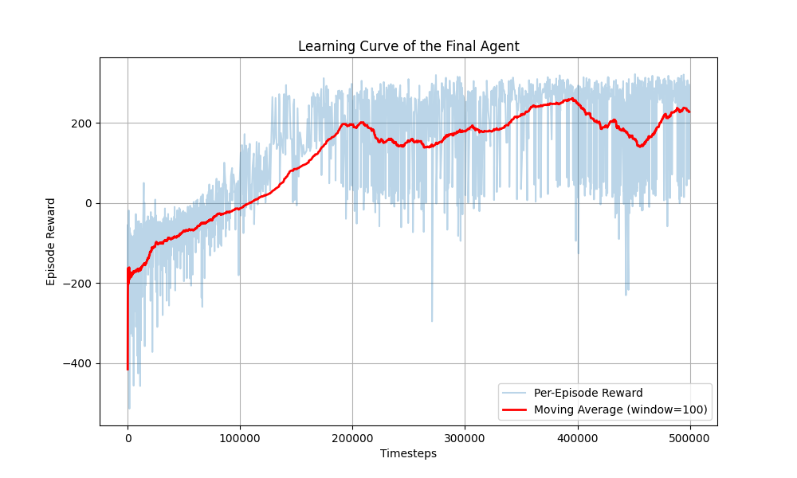
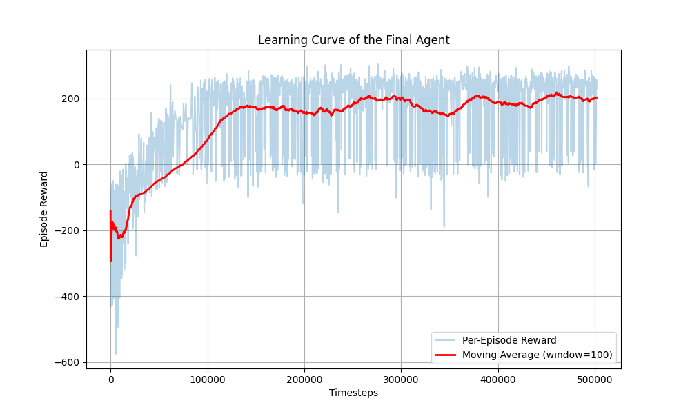
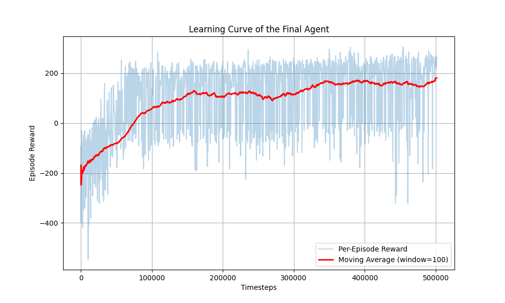
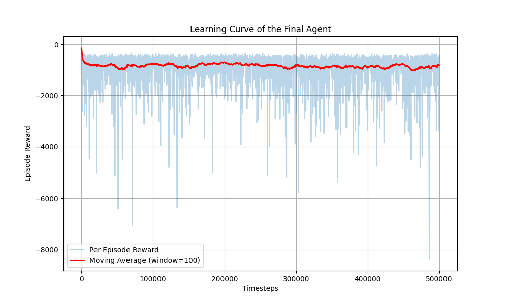

## Analys av resultat

PPO presterade bättre än DQN med ett medelvärde på ``` 175.96 +/- 102.88 och 195.76 +/- 74.14```, medan DQN hade ett medelvärde på ```282.30 +/- 28.12```
Inlärningskurav för PPO var mer stabil, medan DQN:s inlärningskurva var lite mer volatil men fortfarande rätt stabil påväg uppåt hela tiden.
Att träna med DQN modellen tog 23 minuter, medan PPO tog 10-12 minuter (där träning på 12min gav bättre resultat). Dock verkar det som att man kunde tränat DQN lite kortare, med 400000 timesteps. PPO verakde bara bli bättre och bättre, så bästa värdet kom på slutet.

### Jämföresle av modellerna 
- DQN är en värde-baserad RL algoritm som passar bätte för diskreta action-spaces (såsom lunarlander har), där det finns ett begränsat antal möjligheter av drag man kan göra, såsom i simpla videospel och schack. Så den funkar bättre i enkla miljöer med tydliga belöningar
- DQN är off-policy (agenten lär sig från tidigare erfarenheter)

- PPO är bättre för mer komplexa miljöer med kontinuerliga action-spaces, vilket inte stämmer in på Lunarlander
- PPO är policy baserat, så den bygger en funktion som säger åt vad för action agenten ska ta
- PPO är on-policy (agenten lär sig från färsk data som är genererad av den nuvarande policyn)

Eftersom att lunarlander har ett diskret action-space så kan det förklara varför DQN funkar bra här. Trots att jag försökte få PPO att bli bättre, så verkar det inte alls ha gått så bra, trots många timmars testande. Kan hända att jag hade för mycket träning och för många hyperparamterar att köra igenom, så hade kanske behövt träna och testa en längre tid. 4h var inte tillräckligt. Jag skulle dra slutsatsen att DQN gjorde bäst ifrån sig på denna policy är mer anpassad efter en mijlö som lunarlander, med sitt diskreta action space och mer simpel miljö.
- Båda modellerna lyckas dock lösa miljöerna då båda agenternas medelvärde överstiger 150!

#### DQN (super!)



#### PPO försök 1 (bästa PPO försök)


#### PPO försök 2 (mindre bra PPO försök, men okej)



#### DQN med Optuna (super dålig)

#### Trots att denna är sparad som "best_lunar_model" så är det verkligen inte sant. DQN vinner! medelvärdet för denna var super dåligt och låg på ```-868.30 +/- 577.31 ```

```
[I 2025-10-02 16:31:24,225] Trial 29 finished with value: -129.1595839 and parameters: {'learning_rate': 0.011080278285381308, 'gamma': 0.9981328592855914, 'layer_size': 256, 'batch_size': 32, 'gae_lambda': 0.9095940576434207, 'n_epochs': 5, 'clip_range': 0.2596765806276585, 'n_steps': 512}. Best is trial 25 with value: -124.87903794000002.

--- Best Trial Information ---
  Value (Mean Reward): -124.88
  Params: 
    learning_rate: 0.05183056215028778
    gamma: 0.9759905745876845
    layer_size: 256
    batch_size: 32
    gae_lambda: 0.8195345417244579
    n_epochs: 5
    clip_range: 0.19286722609813378
    n_steps: 512

--- Training the final, best model ---
``` 

### Övrigt
De modellerna som tränades senast är sparade i zippar. Loggarna finns i logs mappen. Optuna datan finns i databasen. 